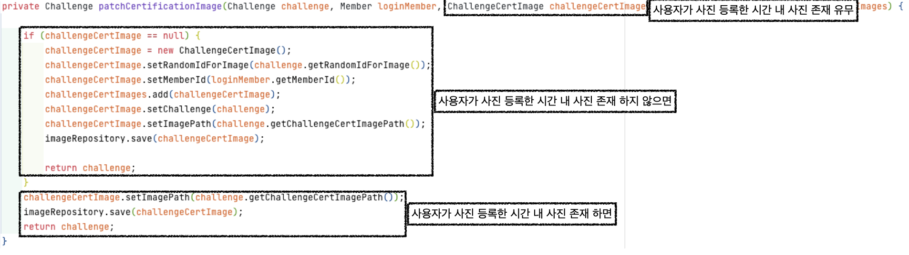
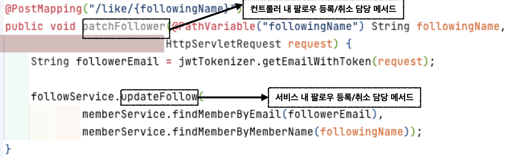
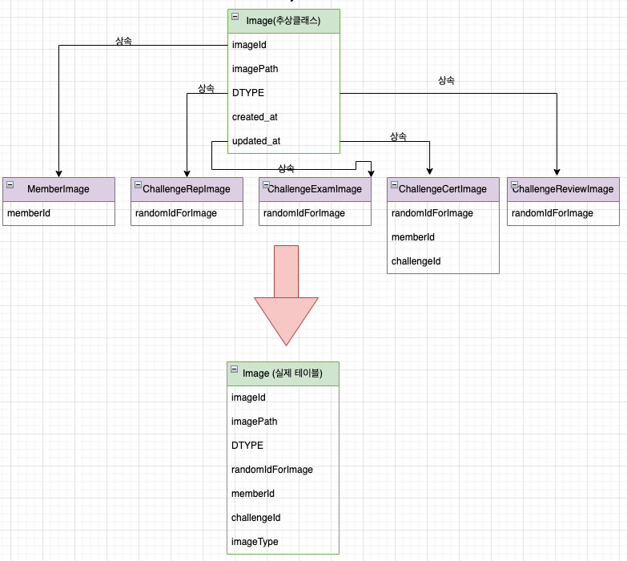

# :alarm_clock: 슬기로운 생활
 - 웹사이트 : [바로가기](https://wiselife.click/)
   
신년마다 사람들은 그해에 이루고자 하는 목표를 생각합니다.
 하지만 그 목표들을 이루지 못 하고 내년으로 미뤄지게 되는 경우가 다반수죠.
 마라톤에도 페이스메이커가 있듯 목표달성을 도와주는 서비스가 필요하다면 슬기로운 생활과 함께하세요.

 

## 1. 제작 기간 & 참여인원

---

    개발 기간 2022.11.8 - 2022.12.7 (30일)
    백엔드 3명, 프론트 엔드 3명 참가

 

## 2. 사용 기술

---

### Backend

 
 

 

 

## Collaboration Tools

 

 
 

## 3. ERD 설계
---
</img> 
 

## 4. 맡은 핵심 기능
---
이 서비스의 핵심 기능은 사용자가 챌린지에 정의된 인증 기준에 부합되게 인증 사진을 올리면, 그예 따른 성공률을 계산하여, 챌린지 종료시 사용자에게 보상을 해주는 동기부여 서비스입니다. 

### 4.1 사용자 흐름

 

### 4.2 ChallengeController [코드링크-ChallengeController](https://github.com/dbgys1127/wiselife/blob/main/server/wiselife/src/main/java/be/wiselife/challenge/controller/ChallengeController.java) 

- 가입된 사용자의 정보 확인 [코드링크-LoginAspect](https://github.com/dbgys1127/wiselife/blob/main/server/wiselife/src/main/java/be/wiselife/aop/LoginAspect.java) 
  - 모든 페이지 접근 마다 필요한 작업으로 `중복방지를 위해 AOP로 관심사를 분리` 
- 인증사진 S3 등록과 S3에 저장된 주소 DB 저장 요청

### 4.3 ChallengeService 
- 인증사진 등록과 관련된 로직 처리를 ImageService에 요청했습니다.

### 4.4 ImageService [코드링크-ImageService 내 patchChallengeCertImage 메서드](https://github.com/dbgys1127/wiselife/blob/main/server/wiselife/src/main/java/be/wiselife/image/service/ImageService.java) 

 1. 인증 가능 시간인가? 

<b>코드 펼치기</b>

    - 사용자가 사진 등록하는 시간이 챌린지 인증시간이 아니면, 예외 발생

 2. 챌린지 참여회원인가?

<b>코드 펼치기</b>

    - 사용자가 챌린지에 참여하고 있는 회원이 아니라면, 챌린지에 참여를 먼저 해야한다는 예외 발생

 3. 같은 시간에 등록한 사진이 존재하는가?

<b>코드 펼치기</b>
 

    - `고민` 인증사진을 수정할때, 따로 URI를 둬야할까? 
    
    - `해결책` 컨트롤러에서 인증사진 처리 메서드를 `patch`MemberCertification로 둔 것처럼 요청을 처리하는 비즈니스 로직 부분에서 동일한 시간에 사진이 있다면 수정, 없다면 신규등록되게 구성하였습니다.

4. 오늘 의무 인증 횟수를 다 채웠는가?

<b>코드 펼치기</b>

    - 챌린지에서 명시된 금일 인증횟수를 초과했을때, 불필요한 데이터가 쌓이지 않게 예외처리가 필요하다 생각했습니다.

5. 인증 사진이 성공적으로 등록된 후 처리되는 작업
    - 챌린지 참여 회원이 그날 의무 인증횟수를 만족하면 성공일로 간주하고, 성공률을 계산하였습니다. (ex. 4일차에 3일 성공하면 75%)

<b>코드 펼치기</b>

    - 인증할때 마다 회원 등급 변화 

<b>코드 펼치기</b>

## 5. 프로젝트 진행하며 해결했던 문제

### 5.1 분리된 URI 처리 메서드 중 통합할 수 없을까?

- `문제점` 기능 증가에 따른 URI 증가로 프론트엔드가 API를 쓰면서 혼란스러워 했고, 사용자가 눌러야할 버튼이 늘어남에 따라 이용의 불편함이 생기겠다는 의문이 들었습니다.
- `해결책` 문제해결의 핵심은 URI를 줄이는 것이라고 정의하여, 컨트롤러 계층에서 분리된 URI를 하나로 줄이고, 비즈니스에서 조건에 따른 처리 방식을 분리했습니다.
- `문제해결 지점` 
    - 팔로우 등록 URI, 팔로우 취소 URI -> 팔로우 등록/취소 URI로 통합
    - 이미지 등록 URI, 이미지 수정 URI -> 이미지 등록/수정 URI로 통합

<b>코드 펼치기</b>
- 팔로우 등록/취소 코드 
- 이미지 등록/취소 코드

 

### 5.2  QueryDSL을 활용한 동적 쿼리 대응 및 서비스 계층 중복 의존관계 주입 방지

- `문제점 1` 복잡한 동적쿼리를 간편하게 작성할 방법이 필요했습니다. 
- `문제점 2` 서비스 계층에서 JPA 인터페이스와, QueryDSL 인터페이스를 두번 의존관계를 주입받는 점에서 중복이 발생했습니다.
- `문제점 3` 동적쿼리를 한곳에 모아서 관리하고 싶었습니다.
 

- `해결책` QueryDSL을 활용하여 동적쿼리를 작성하였고, 필요한 곳에 상속받게 함으로써, 위 문제들을 해결할 수 있었습니다.

### 5.3 비슷한 엔티티, 상속 관계 매핑으로 중복 방지 및 테이블 단일화를 통한 조회 성능 개선

- `문제점 1` 공통 속성 + 차별화된 속성을 가진 이미지 테이블이 필요했고, 그에 따라 각 이미지 테이블이 공통 속성을 중복해서 작성해야할 지 고민이 되었습니다.
- `해결책 1` 상속관계 매핑을 학습하여, 중복되는 속성은 부모 클래스에 기입하고, 나머지 테이블들이 상속하는 방식으로 해결했습니다.
- `해결책 2` 상속관계 매핑 전략 중 조인 횟수 감소, 조회쿼리 단순화, INSERT 쿼리 중복이 없는 단일 테이블 전략을 선택해서 성능 향성을 도모했습니다.

### 6. 느낀점
개발공부를 시작한 지 6개월 만에 프로젝트를 수행하면서, 함께 일할때, 갖춰야할 자세를 배웠고, 개인적으로 더 신경쓰지 못한 부분에 대한 아쉬움이 있었습니다.   
먼저, 개발이라는 행위가 `추상적인 것을 구현한다는 점에서 구성원 개개인이 상상하는 구현체가 다를 수 있다는 점`을 많이 느꼈고, 공통된 구현체를 머리속에 품기 위해, 9시, 18시 회의를 통해, 애매한 개념을 맞추려고 노력했고, 실무에서도 고민을 나눠야겠다는 생각을 하게 되었습니다.   
개인적으로는 테스트 없이 개발하여 서비스를 만들다 로직적인 오류가 발생할때, 오류지점을 한참 찾아야한 것에 대해 TDD에 대한 필요성을 느꼈고, 좀 더 객체지향적으로 설계하지 못해, 클린하지 못한 코드작성이 아쉬웠습니다. 끝으로 서비스 성능테스트 및 개선에 대한 능력을 좀 더 키우는 것이 앞으로 해야할 일이라고 느꼈습니다. 
